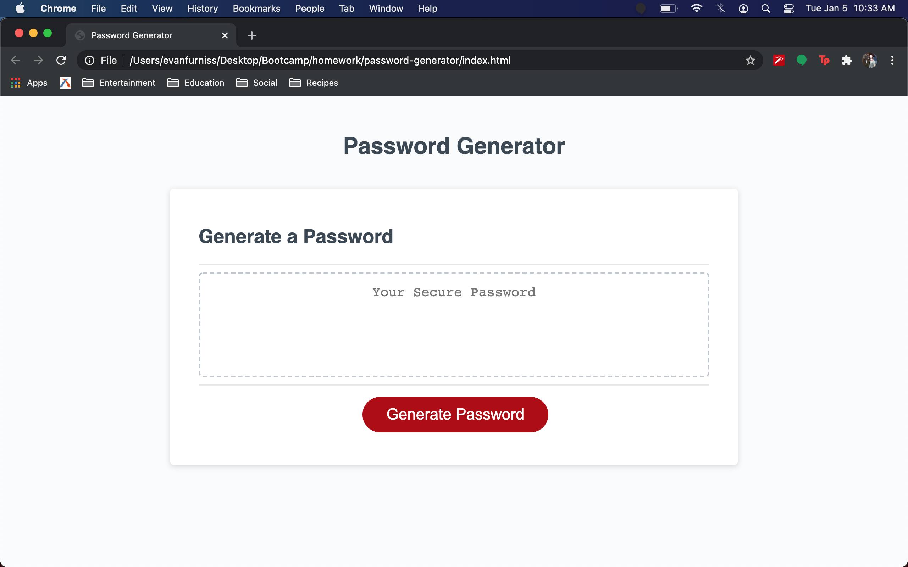

# Password Generator

## Overview

This project creates a randomly generated password of the users choosing. Users can select the requirements for the password including length, numbers, lower case letters, upper case letters, and special characters. Upon clicking the "Generate Password" button, users will select the options they wish to utilize for their password creation. Once the user's requirments are filled, users click the "Create" button, which will generate their random password and display it in the text area. 

The password generator uses JavaScript as the primary language to create and run functions that will take users' requirements and modify the elements on the HTML and CSS files. The password is created using the random math functions, for loops, if/else statements, dev created functions, and runs using eventListeners.

Users can utilize this tool to quickly create secure passwords while creating accounts, updating old passwords, or adding a level of security they may not have had otherwise.

## Resources

w3schools's JavaScript HTML DOM articles were incredibly helpful in the building of this application.

## Repository Links

https://github.com/evanfurniss/password-generator

https://evanfurniss.github.io/password-generator/

## Images

 

 
